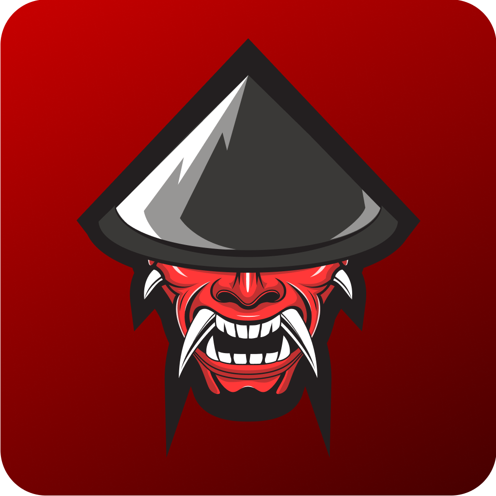

<h1 align="center">
  
</h1>

<h1 align="center">
  🎮 Mãozinha Gamer
</h1>

<h4 align="center">
  O aplicativo definitivo com mapas, dicas e loadouts para gamers mobile. 🕹️🔥
</h4>

<p align="center">
  <a href="#-sobre-o-projeto">Sobre</a> •
  <a href="#-funcionalidades">Funcionalidades</a> •
  <a href="#-tecnologias">Tecnologias</a> •
  <a href="#-como-executar">Como Executar</a> •
  <a href="#-prints-de-tela">Prints</a> •
  <a href="#-informações-técnicas">Info Técnicas</a> •
  <a href="https://play.google.com/store/apps/details?id=com.maozinhagamer.maozinhagamerapp">Download</a>
</p>

---

## 🎯 Sobre o Projeto

O **Mãozinha Gamer** é um app criado para auxiliar jogadores em jogos populares como *Call of Duty Mobile*, *The First Descendant* e outros títulos competitivos. O foco é fornecer **informações úteis, mapas interativos, loadouts otimizados**, dicas estratégicas e atualizações frequentes — tudo de forma acessível e intuitiva.

📱 Perfeito para quem quer melhorar sua gameplay com praticidade no celular.

> Projeto mantido por [Mãozinha Gamer no YouTube](https://www.youtube.com/channel/UCqB3_WL9vGS751N6UudXHuw)

---

## ✨ Funcionalidades

- 📚 Guias e dicas para jogos competitivos
- 🗺️ Mapas interativos com marcações e segredos
- 🔫 Loadouts prontos e otimizados
- 🔎 Busca inteligente por conteúdo
- 🌙 Modo escuro
- 🔥 Atualizações frequentes via Firebase
- 📲 Publicado na Google Play Store

---

## 🛠️ Tecnologias

- **React Native** `0.79.5`
- **Expo** `^53.0.16`
- **Expo Router** `~5.1.2`
- **Firebase (v11)** para dados e autenticação
- **Lottie** para animações
- **AsyncStorage**, **NetInfo**, **Vector Icons**
- Navegação via `@react-navigation`
- Suporte a vídeo com `react-native-video` e `webview`

---

## 🚀 Como Executar Localmente

### ✅ Pré-requisitos

- Node.js
- Git
- Expo CLI

```bash
npm install -g expo-cli
