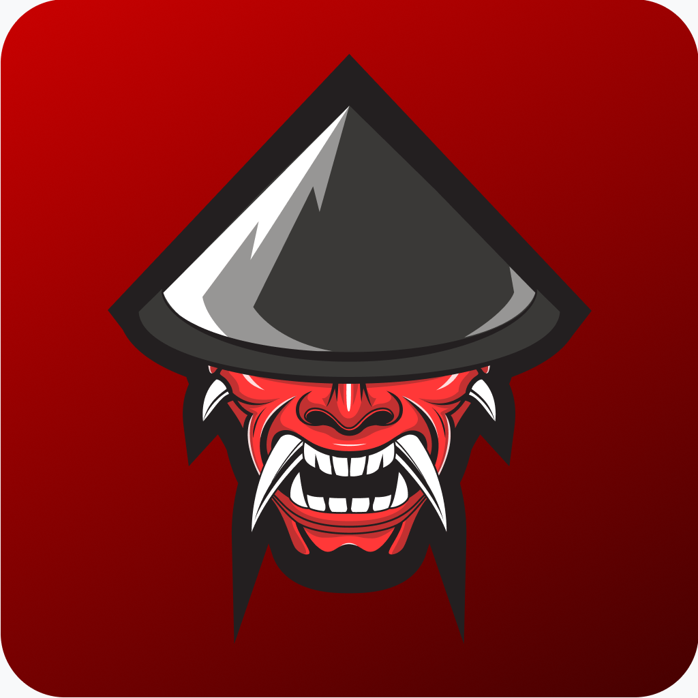
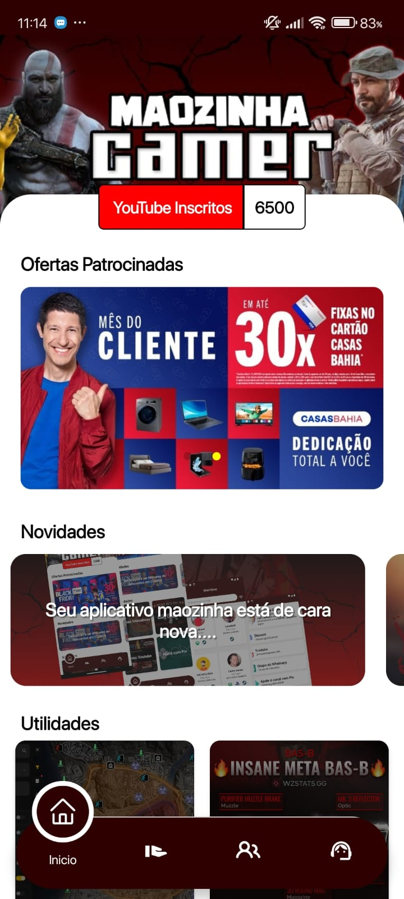
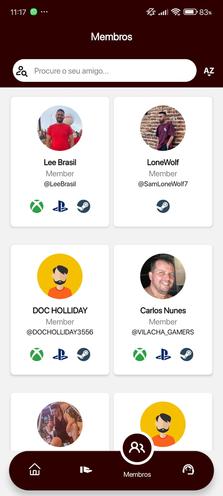
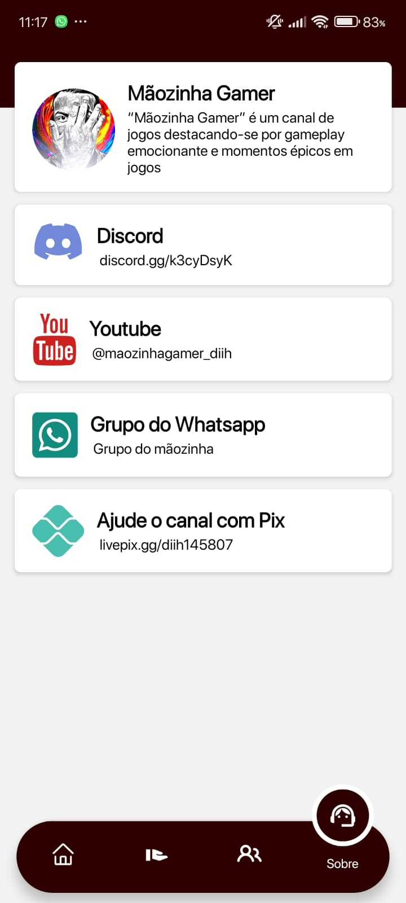

<h1 align="center">
    
</h1>

<h1 align="center">
  # 🎮 Mãozinha Gamer
</h1>

<h4 align="center">
  ☕ Code and coffee
</h4>

Bem-vindo ao **Mãozinha Gamer**, o aplicativo oficial do canal [Mãozinha Gamer no YouTube](https://www.youtube.com/channel/UCqB3_WL9vGS751N6UudXHuw)! Este app é uma extensão do canal, com dicas, truques e mapas para diversos jogos.

## 🛠 Tecnologias e Ferramentas

- **Node.js** - Backend robusto.
- **React Native** - Desenvolvimento mobile multiplataforma.
- **Expo** - Gerenciamento do ciclo de vida do app.
- **Visual Studio Code** - Ambiente de desenvolvimento.
- **Firebase** - Autenticação e banco de dados em tempo real.

### Bibliotecas Principais

- `react-navigation` - Navegação entre telas.
- `axios` - Requisições HTTP.
- `redux` - Gerenciamento de estado.
- `styled-components` - Estilização de componentes.
- `firebase` - Integração com o Firebase.

## 📲 Funcionalidades

- Dicas e truques de jogos.
- Mapas interativos.
- Tutoriais e estratégias para gamers de todos os níveis.
- Novidades e atualizações frequentes.

## 🚀 Instalação

### Pré-requisitos

Certifique-se de ter instalado as seguintes ferramentas:

- [Node.js](https://nodejs.org)
- [Expo CLI](https://docs.expo.dev/get-started/installation/)
- [Visual Studio Code](https://code.visualstudio.com/)

### Passos para instalar

1. Clone o repositório:

   ```bash
   git clone https://github.com/leeandersonaz09/Maozinhagamer-app.git
   cd Maozinhagamer-app
   ```

2. Instale as dependências:

   ```bash
   npm install
   ```

3. Configure o Firebase adicionando um arquivo `firebase.js`:

   ```javascript
   export default {
     API_KEY: "<sua_api_key>",
     AUTH_DOMAIN: "<seu_auth_domain>",
     PROJECT_ID: "<seu_project_id>",
   };
   ```

4. Inicie o app:

   ```bash
   expo start
   ```

## 📷 Screenshots

### Tela Inicial
<p align="center">
    
    
    
    

</p>

### Lista de Dicas


## 💡 Contribuições

Contribuições são bem-vindas! Abra uma issue ou um pull request com sugestões e melhorias.
